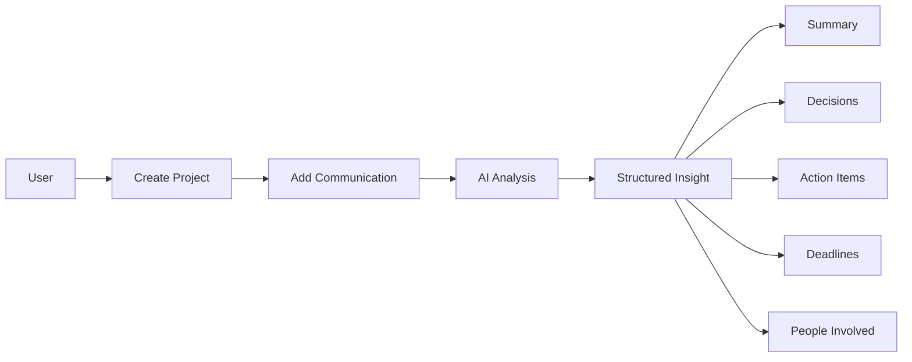
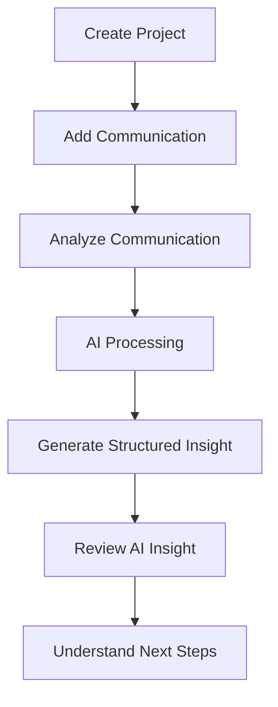
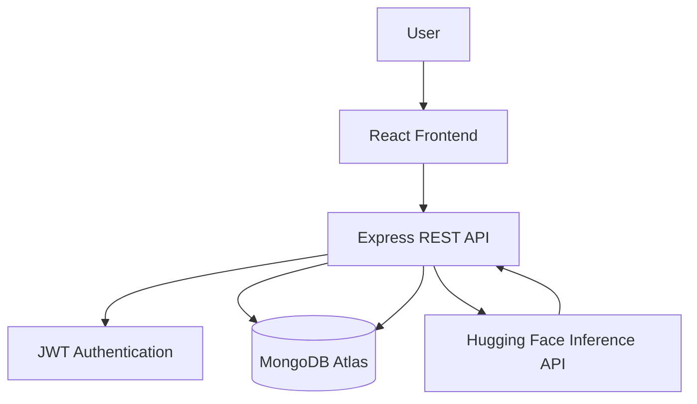

# 🚀 ArchFlow AI

### Less catching up. More moving forward.

> **Turn scattered project conversations into structured project intelligence.**

ArchFlow AI is an AI-powered project communication intelligence platform built for the **ArchScale Guild Intern Technology Hackathon 2026 — AS-02: "Make project communication intelligent, not overwhelming."**

It transforms project conversations into structured insights so teams can quickly understand:

**Summary • Decisions • Action Items • Deadlines • People Involved**

---

## ✨ Why ArchFlow AI?

Project communication is often scattered across meetings, emails, chats, and notes.

Important information can easily get buried inside long conversations:

- What was decided?
- Who needs to do something?
- What needs to be completed?
- When is it due?
- Who is involved?

ArchFlow AI turns unstructured communication into information that is easier to understand and act on.

### Without ArchFlow AI

```text
Long Project Conversation
          ↓
      Manual Reading
          ↓
   Find Important Details
          ↓
     Create Tasks
          ↓
      Follow Up
```

### With ArchFlow AI

```text
Project Communication
          ↓
      AI Analysis
          ↓
   Structured Insight
          ↓
 ┌────────┼──────────┐
 ↓        ↓          ↓
Summary Decisions Action Items
          ↓
      Deadlines
          ↓
   People Involved
          ↓
 Project Intelligence
```

---

## 🎯 Problem Statement

### AS-02 — Make project communication intelligent, not overwhelming

Project teams communicate constantly through meetings, emails, chats, notes, and project updates.

While these conversations contain valuable information, important details can become difficult to find.

This can result in:

- Missed action items
- Unclear ownership
- Forgotten deadlines
- Repeated follow-ups
- Difficulty tracking project decisions
- Time wasted reading lengthy communication

### The Goal

Instead of building another large project-management platform, ArchFlow AI focuses on one specific intervention:

> **Turn project communication into clear, structured, actionable information.**

---

## 💡 The Solution

ArchFlow AI provides a centralized workspace where users can:

1. Create and manage projects
2. Add project communications
3. Capture communication context
4. Analyze conversations with AI
5. Extract structured insights
6. Review decisions and action items
7. Identify deadlines and people involved

The core idea is simple:

> **Capture the conversation → understand what matters → make the next steps visible.**

---

# ✨ Key Features

### 🔐 Authentication

- User registration
- Secure login
- Password hashing using bcrypt
- JWT-based authentication
- Protected API routes

### 📁 Project Management

Create and manage projects with:

- Project name
- Description
- Client name
- Project status
- Project ownership

Supported project statuses:

- Planning
- Active
- Completed
- On Hold

### 💬 Communication Capture

Store project communications with:

- Communication title
- Communication source
- Content
- Participants
- Associated project

Supported sources:

- 🗓️ Meeting
- 📧 Email
- 💬 Chat
- 📝 Note

### 🧠 AI-Powered Analysis

ArchFlow AI analyzes communication and extracts:

#### 📝 Summary

A concise overview of the communication.

#### ✅ Decisions

Important decisions explicitly mentioned in the communication.

#### 📋 Action Items

Tasks that need to be completed, including the responsible person and deadline when available.

#### ⏰ Deadlines

Important dates and deadlines mentioned in the communication.

#### 👥 People Involved

People or roles mentioned in the communication.

### 📊 Structured AI Insights

Instead of returning a long AI response, ArchFlow AI presents extracted information in structured sections that are easier to scan and verify.

---

# 🔄 How It Works



### Complete Product Workflow



---

# 🤖 AI Intelligence

ArchFlow AI uses the **Hugging Face Inference API** with the **OpenAI GPT-OSS 120B** model.

The AI is instructed to analyze communication and return structured JSON rather than an unstructured conversational response.

The generated insight follows this structure:

```json
{
  "summary": "",
  "decisions": [],
  "actionItems": [
    {
      "task": "",
      "assignee": "",
      "deadline": "",
      "status": "pending"
    }
  ],
  "deadlines": [
    {
      "description": "",
      "date": ""
    }
  ],
  "peopleInvolved": []
}
```

### 🛡️ AI Design Principle

ArchFlow AI is designed to avoid inventing information.

If something is not explicitly mentioned in the communication, the AI is instructed to return an empty value or array instead of creating unsupported information.

---

# 🧠 AI Insight Example

### Raw Communication

```text
The client approved the revised living room layout and requested
larger windows on the east side.

The architect will prepare the updated floor plan by Friday.

The supplier confirmed that the selected tiles are available and
can be delivered next week.

The client asked the architect to confirm the final window
dimensions before ordering.
```

### Generated Insight

#### 📝 Summary

The client approved the revised living room layout and requested larger windows. The architect will prepare an updated floor plan, while the supplier confirmed tile availability.

#### 📋 Action Item

```text
Task:
Prepare revised design for the living room layout

Assignee:
Architect

Deadline:
Friday

Status:
Pending
```

#### ⏰ Deadline

```text
Revised design delivery
Friday
```

#### 👥 People Involved

```text
Client
Architect
Supplier
```

This structured insight represents the core product experience of ArchFlow AI.

---

# 🏗️ System Architecture



### Architecture Overview

**Frontend**

React application responsible for:

- User interface
- Routing
- Authentication state
- Project management
- Communication management
- AI insight presentation

**Backend**

Node.js + Express REST API responsible for:

- Authentication
- Authorization
- Project operations
- Communication operations
- AI analysis requests
- Insight storage

**Database**

MongoDB stores:

- Users
- Projects
- Communications
- AI insights

**AI Layer**

Communication text is sent to the Hugging Face inference service for analysis. The structured result is then returned through the backend and stored as an AI insight.

---

# 🛠️ Tech Stack

## Frontend

- ⚛️ React
- ⚡ Vite
- 🔀 React Router
- 🔗 Axios
- 🎨 CSS

## Backend

- 🟢 Node.js
- 🚂 Express.js
- 🍃 MongoDB
- 🧩 Mongoose
- 🔐 JWT
- 🔒 bcryptjs

## AI

- 🤗 Hugging Face Inference API
- OpenAI GPT-OSS 120B

## Deployment

- ▲ Vercel — Frontend
- Render — Backend
- MongoDB Atlas — Database

---

# 📂 Project Structure

```text
ArchFlow-AI/
│
├── backend/
│   ├── config/
│   │   └── db.js
│   ├── controllers/
│   │   ├── authController.js
│   │   ├── userController.js
│   │   ├── projectController.js
│   │   ├── communicationController.js
│   │   └── aiController.js
│   ├── middleware/
│   │   └── authMiddleware.js
│   ├── models/
│   │   ├── User.js
│   │   ├── Project.js
│   │   ├── Communication.js
│   │   └── AIInsight.js
│   ├── routes/
│   │   ├── authRoutes.js
│   │   ├── userRoutes.js
│   │   ├── projectRoutes.js
│   │   ├── communicationRoutes.js
│   │   └── aiRoutes.js
│   ├── services/
│   │   └── aiService.js
│   ├── utils/
│   ├── server.js
│   ├── package.json
│   └── .gitignore
│
├── frontend/
│   ├── src/
│   │   ├── components/
│   │   ├── pages/
│   │   ├── services/
│   │   ├── context/
│   │   └── ...
│   ├── index.html
│   ├── package.json
│   └── vite.config.js
│
├── .gitignore
├── README.md
└── package.json
```

---

# 🔌 API Overview

ArchFlow AI uses authenticated REST APIs for workspace data and AI analysis.

## 🔐 Authentication

```text
POST /api/auth/register
POST /api/auth/login
```

## 📁 Projects

```text
POST   /api/projects
GET    /api/projects
GET    /api/projects/:id
PATCH  /api/projects/:id
DELETE /api/projects/:id
```

## 💬 Communications

```text
POST   /api/communications
GET    /api/communications/project/:projectId
GET    /api/communications/:id
PATCH  /api/communications/:id
DELETE /api/communications/:id
```

## 🧠 AI Insights

Analyze a communication:

```text
POST /api/ai/analyze/:communicationId
```

Retrieve an existing insight:

```text
GET /api/ai/insight/:communicationId
```

Protected endpoints require a valid JWT authentication token.

---

# 🔒 Security

ArchFlow AI follows basic security practices including:

- Password hashing with bcrypt
- JWT authentication
- Protected API routes
- Project ownership validation
- Environment variables for sensitive credentials
- `.env` excluded from Git

Sensitive environment variables include:

```env
MONGODB_URI=
JWT_SECRET=
HF_TOKEN=
```

> **Never commit real secret values to GitHub.**

---

# 📸 Screenshots

Screenshots of the deployed application can be added here to showcase the main product experience.

### 🏠 Landing Page

### 📊 Dashboard

### 📁 Projects

### 💬 Communication Details

### 🧠 AI Insights

> **AI Insights is the core product-defining experience of ArchFlow AI.**

---

# 🚀 Local Development

## Prerequisites

Make sure you have:

- Node.js
- npm
- MongoDB or MongoDB Atlas
- Hugging Face API access

## 1. Clone the Repository

```bash
git https://github.com/SHRUTI-GAJJAR/ArchFlow-AI
cd ArchFlow-AI
```

## 2. Backend Setup

```bash
cd backend
npm install
npm run dev
```

Create `backend/.env`:

```env
PORT=5500
MONGODB_URI=your_mongodb_connection_string
JWT_SECRET=your_jwt_secret
HF_TOKEN=your_huggingface_token
```

The backend will run locally on:

```text
http://localhost:5500
```

## 3. Frontend Setup

Open a new terminal:

```bash
cd frontend
npm install
npm run dev
```

Create `frontend/.env`:

```env
VITE_API_URL=http://localhost:5500/api
```

---

# 🌐 Deployment

ArchFlow AI uses a separated frontend/backend deployment architecture.

```text
                    ┌────────────────────┐
                    │       Vercel       │
                    │   React Frontend   │
                    └─────────┬──────────┘
                              │
                              ↓
                    ┌────────────────────┐
                    │      Render        │
                    │  Express Backend   │
                    └─────────┬──────────┘
                              │
                 ┌────────────┴────────────┐
                 ↓                         ↓
        ┌──────────────────┐     ┌──────────────────┐
        │  MongoDB Atlas   │     │ Hugging Face API │
        │     Database     │     │   AI Inference   │
        └──────────────────┘     └──────────────────┘
```

### Frontend

Hosted on **Vercel**.

### Backend

Hosted on **Render**.

Production backend:

```text
https://archflow-ai-hj5p.onrender.com
```

### Database

Hosted on **MongoDB Atlas**.

The frontend communicates with the deployed backend through:

```text
https://archflow-ai-hj5p.onrender.com/api
```

---

# 🏆 Hackathon Context

ArchFlow AI was built for the:

## ArchScale Guild Intern Technology Hackathon 2026

### Selected Challenge

**AS-02 — Make project communication intelligent, not overwhelming**

The project intentionally focuses on one painful part of project workflows instead of attempting to replace an entire project-management ecosystem.

The intervention is:

```text
Capture Conversation
        ↓
Analyze Communication
        ↓
Extract Important Information
        ↓
Make Next Steps Visible
```

---

# 🎯 Product Focus

ArchFlow AI focuses on the point where:

> **A conversation needs to become action.**

Rather than replacing every project-management tool, ArchFlow AI acts as an intelligence layer between communication and execution.

```text
Conversation
     ↓
Understanding
     ↓
Structured Insight
     ↓
Action
```

---

# 🔮 Future Improvements

The following are future possibilities and are **not currently implemented features**.

### 📧 Email Integration

Automatically analyze project-related email conversations.

### 💬 Slack / Microsoft Teams Integration

Capture communication directly from collaboration platforms.

### 🎙️ Meeting Transcript Analysis

Analyze meeting transcripts and extract project intelligence.

### ⏰ Action Item Reminders

Notify responsible team members when tasks approach their deadlines.

### 🔔 Deadline Notifications

Provide proactive notifications for upcoming deadlines.

### 📈 Team-Level Analytics

Analyze communication patterns and project-level activity.

### 🎯 AI Confidence Indicators

Show confidence levels for extracted information.

---

# 🎥 Demo

## 🌐 Live Demo

**[View ArchFlow AI Live](YOUR_VERCEL_URL)**

## 💻 GitHub Repository

**[View Source Code](https://github.com/SHRUTI-GAJJAR/ArchFlow-AI)**

## 🎬 Demo Video

**[Watch the 3–5 minute hackathon walkthrough](YOUR_DEMO_VIDEO_URL)**

---

# 🧪 Validation

The application has been validated through:

- Frontend production builds
- Protected backend API routes
- JWT authentication
- MongoDB persistence
- Project CRUD operations
- Communication CRUD operations
- AI communication analysis
- Structured AI insight storage and retrieval

The interface is designed to provide a responsive experience across:

- 🖥️ Desktop
- 💻 Laptop
- 📱 Tablet
- 📲 Mobile

---

# 👩‍💻 Author

## Shruti Ujeniya

**Full-Stack Web Developer | MERN Stack**

ArchFlow AI was designed and developed as a full-stack AI-powered project communication intelligence platform for the **ArchScale Guild Intern Technology Hackathon 2026**.

### Core Areas

- React.js
- Node.js
- Express.js
- MongoDB
- REST APIs
- JWT Authentication
- AI Integration
- Responsive Web Development

---

# ⭐ Project Highlights

```text
✨ AI-powered communication analysis
🧠 Structured project intelligence
📋 Automatic action-item extraction
⏰ Deadline extraction
👥 People identification
📁 Project-based communication organization
🔐 JWT authentication
⚡ Modern React frontend
🌐 Full-stack deployment
📱 Responsive SaaS experience
```

---

# ❤️ Built with Purpose

## ArchFlow AI

### Less catching up. More moving forward.

> **Turning project conversations into the next actionable step.**
